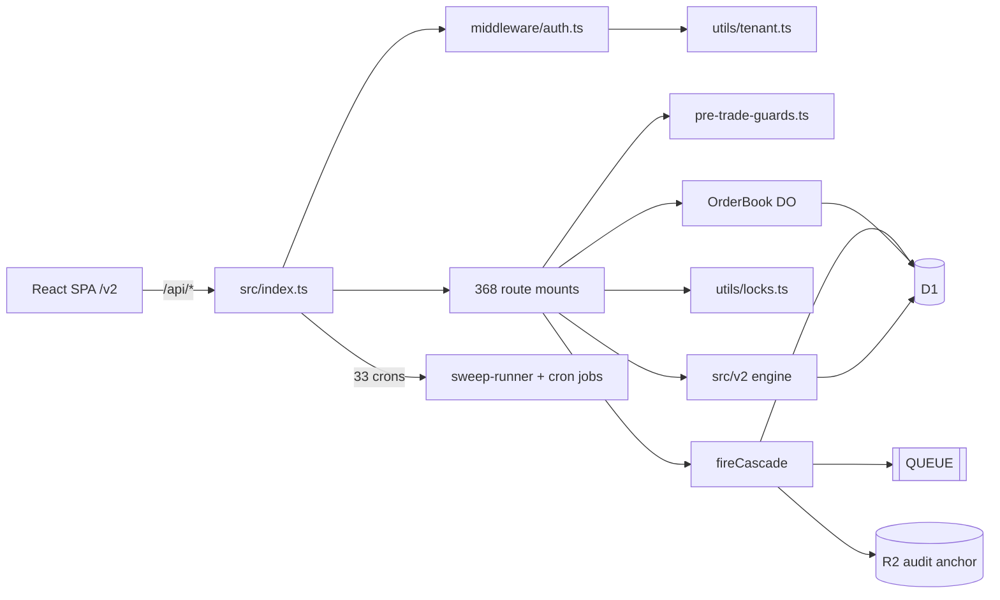
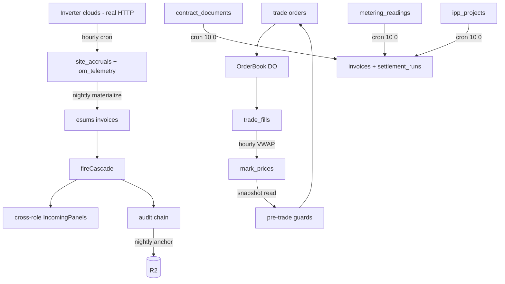

# System Dependency Graph — Open Energy Platform

**Date:** 2026-07-14 · **Branch:** `feat/ground-up-rebuild`

**Scope.** Whole-platform dependency map: the six fan-in/fan-out god nodes, storage bindings per environment (D1/KV/R2/DO/queues), the eleven cross-subsystem edge groups, and the frontend surface graph (v2 surfaces, legacy redirects, `SURFACE_REGISTRY`, dead modules). Every claim is ground-truthed against code with file:line references (counts from grep on 2026-07-14). All backend paths are relative to `open-energy-platform/`; frontend paths to `open-energy-platform/pages/`.

---

## 1. God nodes (fan-in/fan-out hubs)

### 1.1 `src/index.ts` — Worker entry (540 lines)

Single export of `fetch` (Hono app), `scheduled` → `runCron()` (index.ts:528-540), and the `queue` consumer (index.ts:537 → `processCascadeQueueBatch`). Global middleware stack at index.ts:83-98 in fixed order: `securityHeaders` → `corsMiddleware` → `rateLimitMiddleware` (`/api/*`) → `requestLogger` → `optionalAuth` → `idempotency` → `tenantQuotaMiddleware`. All 368 API mounts go through `mountRoutes(app)` (index.ts:149; defined in `src/routes/mount-routes.ts`, which also runs `assertNoRouteShadow`, mount-routes.ts:396).

- **Depends on:** 53 import statements — `src/routes/mount-routes.ts`; `src/utils/sweep-runner.ts` (`runAllSweeps`: 230 registered sweep fns under `Promise.allSettled`, sweep-runner.ts:247); `src/utils/cascade.ts` (`fireCascade`, `processCascadeQueueBatch`); `src/middleware/{security,idempotency,auth,tenant-quota}.ts`; a side-effect import of `src/cascade-rules` at index.ts:9 registering all 70 cascade rules at boot; ~35 cron-utility functions imported from individual route modules (index.ts:17-74). Re-exports the `OrderBook` DO (index.ts:78).
- **runCron dispatch:** `switch (pattern)` with 33 `case` arms (index.ts:251-525), one per `wrangler.toml` cron expression; each job wrapped in `safe()` (index.ts:239) which logs `cron_job_failed` and returns null — one failing job never kills the tick. Unknown pattern → `logger.warn('cron_unknown_pattern')` (index.ts:524); `tests/cron-contract.test.ts` pins declared-pattern ↔ case parity. Admin re-run endpoint `/api/admin/cron/run-once` at index.ts:152-168.
- **Error surface:** `app.onError` (index.ts:196) classifies D1 constraint failures → 409/422 (`classifyConstraint`, index.ts:176) and JSON parse errors → 400 (`classifyParseError`, index.ts:190); 5xx rows persist to `error_log` (index.ts:217-223). `app.notFound` (index.ts:228) falls through to the `ASSETS` binding for the SPA.
- **Blast radius:** total. A boot-time throw (bad import, cascade-rule registration error) takes down every API route, the SPA shell, all 33 crons, and the queue consumer simultaneously. Wrong middleware ordering (e.g. idempotency before optionalAuth) silently breaks idempotency scoping platform-wide (comment at index.ts:87-92).

### 1.2 `fireCascade()` — `src/utils/cascade.ts` (2,940 lines)

The one mutation fan-out, defined at cascade.ts:2520. 329 files import it; **1,065 call sites** in non-test `src/`, plus the cron path (esums financials, index.ts:316). The `EventType` union at cascade.ts:16 has **1,735 event-name members** — every domain event on the platform is a literal in this one type.

Stages, in order:

1. **Audit + notifications** — fast path batches both into one `env.DB.batch()` (`tryBatchAuditAndNotifications`, cascade.ts:2651); fallback per-stage `runStage(..., 'audit'|'notifications')` (cascade.ts:2528-2529) via `createAuditLog` / `createNotifications`.
2. **Tamper-evident audit chain** — `autoAppendAudit` (cascade.ts:2638), awaited but error-isolated; lazy `import('./audit-chain')` breaks the cascade↔audit-chain cycle; skipped for `audit.event_appended` to prevent recursion (cascade.ts:2538).
3. **Webhooks** — fire-and-forget `void runStage(ctx, 'webhooks', deliverWebhooks)` (cascade.ts:2548); slow external receivers never block the request.
4. **Registry / analytics / commercial** — cascade.ts:2596-2598: `runCascadeRegistry` (cross-role follow-ons; rules registered via `registerCascadeRule`, cascade-registry.ts:22 — 70 registrations across 32 files in `src/cascade-rules/`), `recordPlatformEvent` (analytics-sink.ts), `computeAndRecordFee` (fee-engine.ts). If `env.QUEUE` is bound, these three enqueue instead (`CascadeQueuePayload`, cascade.ts:2565-2584) and are processed by `processCascadeQueueBatch` (cascade.ts:2605) via the Worker `queue` handler; binding absent → once-per-process warn + inline run (cascade.ts:2585-2595). Briefings are not a distinct stage — briefing/IncomingPanel effects run as cascade-registry rules (`src/cascade-rules/`).

**DLQ + retry:** `runStage` (cascade.ts:2703) — 3 attempts, exponential backoff 50/100/200 ms; terminal failure → `writeToDlq` (cascade.ts:2728) persisting the full `CascadeQueuePayload` into `cascade_dlq` (status `pending`). Replay via `retryDlqItem` (cascade.ts:2788) / `resolveDlqItem` (cascade.ts:2899), exposed at `POST /api/admin/cascade-dlq/:id/retry|resolve` (src/routes/admin.ts:613, :628). Nightly purge of resolved/abandoned rows >90 d in the `5 0 * * *` cron (index.ts:341-345).

**Blast radius:** fireCascade never throws to callers (every stage isolated), so a break here does not 500 requests — it silently severs audit trails, notifications, cross-role briefings, webhooks, and fee accrual for all 1,065 call sites at once. Failure is invisible until DLQ inspection, which is why the DLQ console and the `cascade_queue_binding_missing` warning exist (cascade.ts:2592).

### 1.3 `src/middleware/auth.ts` — `getCurrentUser` / `authMiddleware` (443 lines)

361 files import `authMiddleware` (351 `module.use('*', authMiddleware)` sites — per-module, not global); 350 files import `getCurrentUser` with **2,200 call sites**. `optionalAuth` is mounted globally at index.ts:92.

`authMiddleware` (auth.ts:223): Bearer header OR `oe_access` httpOnly cookie → `verifyToken` (auth.ts:101; ES256 preferred with HS256 fallback; algorithm-confusion guard at auth.ts:129 rejects HS256 tokens when a public key is configured; constant-time HMAC compare at auth.ts:134-141) → tenant resolution `resolveTenantIdCached` (auth.ts:173; KV cache `auth:tenant:<pid>` TTL 120 s, `__missing__` tombstone; invalidated via `invalidateTenantCache`, auth.ts:215) → sets `c.set('auth', {user:{id,email,role,name,tenant_id}})`. Fail-closed: missing participant → 401; DB failure resolving tenant → 500 AppError (auth.ts:196). `getCurrentUser` (auth.ts:348) reads that context, throwing 401 if absent. Also exports `requireRole` (auth.ts:305, admin always passes), `requireOwnerOrAdmin` (auth.ts:322), `signToken`, `hashPassword`/`verifyPassword` (PBKDF2 100k iterations + legacy bcrypt fallback, auth.ts:399-428), `generateOTP`, `refreshToken`.

**Blast radius:** every authenticated endpoint (all 368 mounts minus login/health). A rejecting bug → platform-wide 401 outage; an accepting bug → total auth bypass, and because `tenant_id` is stamped here, also a tenant-isolation bypass (tenant.ts trusts this value). KV outage degrades to per-request D1 lookups (soft); D1 outage on the tenant lookup 500s every request.

### 1.4 `src/utils/tenant.ts` (208 lines)

11 non-test importers: `routes/{contracts,invoices,marketplace,threads,rbac,ai,onboarding,onboarding-kyc,deals,ona}.ts` + `cascade-rules/sandbox-seed.ts`. 17× `getTenantId()`, 5× `assertSameTenant*/assertResourceTenant` — thin adoption relative to 357 route modules; most isolation rides on `auth.user.tenant_id` scoping in queries instead.

API: `getAuth`/`getTenantId`/`isAdmin` (tenant.ts:19-33); `assertSameTenantParticipant` (tenant.ts:39); `assertSameTenantForResource` (tenant.ts:66, JOIN via owner FK, identifier-regex guard at tenant.ts:74 blocks SQLi via table/column names); `assertResourceTenant` (tenant.ts:96, direct `tenant_id` column); `resolveOrCreateTenant` (tenant.ts:134, deterministic `t_<slug>` bootstrap on self-register); sandbox namespace `sandbox_<pid>` (`sandboxTenantId`/`isSandboxTenant`, tenant.ts:185-195 — GOLDRUSH invariant: demo rows only into `sandbox_*` tenants); `participantsInCallerTenant` (tenant.ts:202). Admin role bypasses every assert. Single trust anchor: `c.get('auth')` populated by auth.ts.

**Blast radius:** cross-tenant data leakage on the ~10 route modules that use it (contracts, invoices, marketplace, deals, threads, ONA…), plus sandbox/demo data bleeding into real tenants if the `sandbox_` invariant breaks. Bounded compared to auth.ts, but these are the highest-value commercial documents.

### 1.5 `src/utils/locks.ts` (91 lines)

9 non-test dependents, 11 `withLock()` call sites: `utils/chain-esign.ts:79`; `utils/audit-chain.ts:140` (`audit:<entity_type>` — serialises every tamper-evident chain append, so transitively load-bearing for all 1,065 fireCascade sites); `routes/contracts.ts:767`; `routes/trading.ts:954`; `routes/carbon.ts:163`; `routes/settlement-automation.ts:63`; `routes/settlement-deep.ts:76`; `routes/deals.ts` (4 sites: :497, :545, :649, :660 — offer accept + auction clear).

API: `acquireLock` (locks.ts:26) — `INSERT OR IGNORE` into `advisory_locks` keyed on `lock_key`, then steal-if-stale via `UPDATE ... WHERE expires_at < now` (locks.ts:52). `releaseLock` (locks.ts:67) deletes only if holder matches. `withLock` (locks.ts:77) throws `LockBusyError` (locks.ts:19) when contended; default TTL 15 s. Explicitly NOT a distributed mutex — two callers racing a stale TTL can both steal (header comment, locks.ts:14-15). Depends only on `env.DB` (`advisory_locks`).

**Blast radius:** lock loss → double settlement runs, double auction clears, forked audit-chain heads. Lock stuck → `LockBusyError` storms on trading, deals, settlement until TTL reaps. Scoped to ~9 modules, but they are the money paths.

### 1.6 `src/utils/pre-trade-guards.ts` (419 lines)

7 non-test importers: `routes/trading.ts` (`evaluateOrder` at :362 order placement, :777 amend; snapshot loader `loadRiskSnapshot` at trading.ts:30), `routes/deals.ts:563` (deal offer accept re-runs the same guard), `routes/admin-market-halt.ts`, `utils/deal-registry.ts`, `utils/rec-trading.ts`, `utils/rejection-explainer.ts` (codes → remediation text), `cascade-rules/onboarding-provisioning.ts`.

Pure functions — zero imports, no I/O; all state arrives via the `RiskSnapshot` built by `loadRiskSnapshot` in trading.ts. `REJECTION_CODES` closed enum of 20 codes (pre-trade-guards.ts:19-44). `evaluateOrder(order, snapshot)` (pre-trade-guards.ts:142) checks in order: volume/display-size sanity → KYC/suspension → `participant_market_access` backstop (:183 — the SOLE authoritative market-access gate; a former route fence was removed as dead code, comment :106-111) → FSCA/STOR trading block (:198) → margin-call gate (:209) → market state → mark freshness (`STALE_MARK_MAX_MINUTES = 30`, :132) → price band → position limit → order-type/TIF/post_only/reduce_only/FOK checks → credit headroom → initial-margin vs collateral (`INITIAL_MARGIN_RATE = 0.10`, :128). Returns `{ok:true, reserved_margin_zar}` or `{ok:false, reason_code, detail}`; trading.ts persists the first failure to `trade_order_rejections`. Also `suggestedSizeMwh` (:403) for UI ghost text.

**Blast radius:** every order and deal acceptance. Too-strict → trading halts platform-wide (compounded by the VWAP cron dependency — stale marks alone halt trading, per index.ts:293-295 comment). Too-lenient → unmargined/over-limit/KYC-less orders reach the OrderBook DO, and since `evaluateOrder` is the only market-access gate, a regression is a direct compliance breach.

### 1.7 Cross-hub coupling

- auth.ts → tenant.ts → every tenant-fenced route: one trust chain; `tenant_id` is computed once in authMiddleware and never re-verified downstream.
- fireCascade → locks.ts via audit-chain.ts (`audit:<entity_type>` lock inside `appendAudit`): heavy cascade traffic contends on per-entity-type audit locks.
- index.ts crons keep the guards alive: `publishVwapMarks` hourly (index.ts:295) feeds `RiskSnapshot.mark_age_minutes`; if that cron dies, pre-trade-guards' STALE_MARK halts all trading within ~30 min.
- index.ts `queue` handler ↔ fireCascade `CascadeQueuePayload` is a symmetric contract (cascade.ts:2744 comment) — DLQ replay, queue consumer, and inline execution all rehydrate the same shape.

---

## 2. Storage & bindings

Named wrangler envs inherit nothing — every binding is redeclared per env (wrangler.toml:203-204). All three envs run the identical 33-cron set (wrangler.toml:159-194, :276-311, :382-417).

### 2.1 Bindings per environment (wrangler.toml)

| Binding | default (demo, oe.vantax.co.za) | `[env.live]` (cec.vantax.co.za) | `[env.dev]` (dev.open.vantax.co.za) |
|---|---|---|---|
| `DB` (D1) | `open-energy-db` id `e0665a44-…` (:68-72) | `cec-energy-db` id `ec72fd09-…` (:248-252) | `open-energy-dev-db` id `5e5f6367-…` (:356-360) |
| `KV` | ns `aa6172248d…` (:64-66) | ns `35ec13fbde…` (:244-246) | ns `efa9738ef8…` (:352-354) |
| `R2` | `open-energy-vault` (:60-62) | **same bucket reused** — live keys tenant-prefixed `t_<slug>/…` (:239-242) | same bucket reused (:348-350) |
| `QUEUE` (producer+consumer) | `open-energy-cascade` (:147-154) | `cec-energy-cascade` (:265-272) | `open-energy-dev-cascade` (:373-380) |
| `ORDER_BOOK` (DO) | class `OrderBook`, sqlite (:85-91) | same (:257-263) | same (:365-371) |
| `AI` (Workers AI) | `[ai]` (:78-79) | (:254-255) | (:362-363) |
| `ASSETS` | `pages/dist`, SPA fallback (:27-30) | (:214-217) | (:329-332) |

**Commented / dormant D1 shards** (declared optional in `HonoBindings`, src/utils/types.ts:40-74): `METERING_DB_CURRENT` hot current-month shard (wrangler.toml:93-104, routed by `src/utils/metering-router.ts`; archive shards `METERING_DB_ARCHIVE_YYYY_MM` created monthly by operator); `ESUMS_TELEMETRY_DB` Tier 2 telemetry D1 (:106-115, migration 380 table); `ESUMS_DB_<SHARDKEY>` Tier 3 per-project D1 (:117-124); `TELEMETRY` Analytics Engine dataset Tier 4 (:126-132) and `HYPERDRIVE` Tier 5 Postgres (:134-142).

### 2.2 KV

Read-through cache for expensive aggregates via `cached()` in `src/utils/kv-cache.ts:1-25` (TTLs 60–300 s, `?nocache=1` bypass, prefix-rotation invalidation). Other consumers: auth/session middleware (`src/middleware/auth.ts`, `security.ts`, `tenant-quota.ts`, `entitlement.ts`), `reference-cache.ts`, notification/webhook engines.

### 2.3 R2 (`open-energy-vault`) key layout

- `vault/<entity_type>/<entity_id>/<id>/<safeName>` — document vault uploads (`src/routes/vault.ts:159-161`; metadata row in `vault_files`).
- `backups/<YYYY-MM-DD>/d1-<stamp>.sql.gz` — encrypted D1 dumps (`src/routes/backup.ts:74-79,94`; catalog table + `R2.list({prefix:'backups/'})` fallback :200).
- `archive/metering/<YYYY>/<MM>/<connection_id>.json.gz` and `archive/audit/<YYYY>/<MM>/<YYYY-MM-DD>.json.gz` — cold-tier archival (`src/utils/data-tier.ts:25-36`; writers `src/routes/data-tier.ts:106-168`).
- `audit-anchor/<YYYY-MM-DD>/<HH>.json` — hourly audit-chain head anchor (`src/utils/audit-chain.ts:452`). `publishChainHeadToR2(env)` (audit-chain.ts:398) snapshots every `audit_chain_state` head; idempotent per (date, hour) via `audit_chain_anchors` ledger row; bucket resolution falls back `AUDIT_ANCHOR ?? VAULT ?? R2` (audit-chain.ts:385); wired into the `30 0 * * *` cron at src/index.ts:339.

Live/demo/dev share the one bucket; isolation is by tenant-prefixed keys only (wrangler.toml:204,239).

### 2.4 Queues — cascade fan-out

The queue producer/consumer blocks in wrangler.toml are **uncommented and active** in all three envs (an earlier draft of this doc called them commented — corrected). `fireCascade()` sends `CascadeQueuePayload` to `ctx.env.QUEUE` for the registry/analytics/commercial stages (cascade.ts:2565-2582); the consumer is the Worker `queue()` export → `processCascadeQueueBatch(batch, env)` (src/index.ts:537-538, cascade.ts:2604+). The queue **resource** must still exist (`wrangler queues create open-energy-cascade`, comment at cascade.ts:2559-2564); if `env.QUEUE` is undefined at runtime the cascade runs **inline** on the request path with a once-per-process `cascade_queue_binding_missing` warn (cascade.ts:2585-2597). `QUEUE?` is optional in `HonoBindings` (src/utils/types.ts:89). `audit.event_appended` never enqueues (recursion guard, cascade.ts:2564).

### 2.5 Durable Objects

`OrderBook` (`src/do/order-book.ts`) is the **only** DO class that exists; `src/do/` contains nothing else. One instance per shard: `deriveShardKey(energyType, deliveryWindow)` (src/utils/matching.ts:179-183) returns `` `${energyType.toLowerCase()}|${deliveryWindow.slice(0,10) || 'ANY'}` `` — energy_type × delivery-day, so same-day intra-day orders match in one book. `HonoBindings` also types `ESCROW_MGR`, `RISK_ENGINE`, `SMART_CONTRACT` (src/utils/types.ts:45-48) but no such classes or bindings exist — settlement writes ledger rows with no custody DO behind them.

### 2.6 Migrations

**526** numbered migrations in `migrations/` (highest `526_v2_event_log.sql`; CLAUDE.md's "525" is one behind — corrected here). Discipline: 001-018 clean/idempotent; 019-048 force-applied out-of-band on prod (no `d1_migrations` ledger rows — CI deploy skips them); 049 is `CREATE TABLE IF NOT EXISTS`; 050 reconciled column-by-column by CI (`duplicate column name` = benign); 051+ normal. `wrangler d1 migrations list --remote` permanently shows 049+ as pending because the irregular band is applied via `d1 execute --file` — intentional; do not "fix" the ledger.

### 2.7 v2 event-log tables (`migrations/526_v2_event_log.sql`)

All v2 persistence flows through `D1Store` (`src/v2/store/d1.ts`), constructed once as `new D1Store(c.env.DB)` at src/routes/v2.ts:331 — **v2 shares the main D1**, no separate database. `MemoryStore` (`src/v2/store/memory.ts`) is the behaviour-identical test twin. Every mutation lands in one `db.batch([...])` (all-or-nothing) after validate-before-mutate pre-checks; UNIQUE/PK races map to `ConstraintViolation` via `mapUniqueError` (d1.ts:128-145).

| Table | Purpose | Writers | Readers |
|---|---|---|---|
| `v2_events` | Append-only hash-chained log; PK(txn_id,seq); UNIQUE event_id / idempotency_key / global_seq (gapless, stamped count+1 at commit) (526_…sql:13-39) | `D1Store.commit` (d1.ts:291-323) | `getTxn` (d1.ts:151), `findEventByIdempotencyKey` (:198), `eventsByGlobalSeq` (:460), `eventsForExport` (:497), `maxGlobalSeq` (:446) |
| `v2_txns` | Projection of log tail; `seq` = optimistic-concurrency token; UNIQUE human_ref (sql:43-55) | insert + conditional `UPDATE … WHERE seq=?` in commit (d1.ts:325-364; 0 rows ⇒ `txn_seq` violation :437-441) | `getTxn`, `listTxns` (participant-scoped or public, d1.ts:172-196) |
| `v2_parties` | Insert-only attachments; ended by stamping `until_event_id` (sql:59-67) | commit (d1.ts:366-385) | `getTxn`, `partiesForTxns` (:487) |
| `v2_merkle_roots` | Sealed roots over `global_seq` ranges (sql:70-76) | `sealPendingEvents` (`src/v2/domain/merkle-seal.ts`) via `appendMerkleRoot` (d1.ts:470); manual seam `POST /api/v2/seal` (routes/v2.ts:547-553) | `merkleRoots` (d1.ts:480), `lastSealedGlobalSeq` (:453) |
| `v2_outbox` | Effect rows — engine never runs effects inline (sql:79-86) | engine emits (src/v2/domain/engine.ts:348,375) → commit (d1.ts:406-417) | **no dispatcher drains it yet** — only the two stores reference the table |
| `v2_timers` | Pending SLA/time-bar timers; re-armed by delete-then-insert per txn (sql:89-98) | commit (d1.ts:388-404) | **no cron fires them yet** |
| `v2_reference` | Flat key→value reference store (compliance flags); `atEpochMs` ignored — ponytail-marked for point-in-time upgrade (sql:100-106) | `setReference` (test/seed-only, d1.ts:218-226) | `D1Store.reference` (guard reads, d1.ts:208-214) |
| `v2_claims` | Append-only unique-claim ledger (double-spend guard, e.g. carbon serial ranges); `UNIQUE(key)` **is** the enforcement (sql:108-114) | commit pre-check + insert (d1.ts:272-279,419-422) | pre-check only; claims are permanent |

---

## 3. Cross-subsystem edges

Cron dispatch lives in one switch (`runCron()`, src/index.ts:246-526); every timer edge below is a `case` there. Cascade fan-out (§1.2) is the universal async edge.

### 3.1 Trading: order book DO → matching → marks → risk → settlement artifacts

- **Order placement → DO:** src/routes/trading.ts:395 derives the shard via `deriveShardKey()` (src/utils/matching.ts:179), inserts `trade_orders` (trading.ts:400), reserves margin in `margin_reservations` (trading.ts:423), then `routeThroughOrderBook()` (trading.ts:485-505) calls the `ORDER_BOOK` DO stub (`https://order-book/post`).
- **DO writes fills directly to D1:** the `OrderBook` DO (src/do/order-book.ts:25) runs `matchOrder` from `src/utils/matching.ts` inside a locked critical section (order-book.ts:57-99) and itself inserts `trade_matches` (order-book.ts:210) and `trade_fills` (order-book.ts:215,222). The DO hydrates its book from `trade_orders` (order-book.ts:145-160) — a bidirectional table edge trading↔DO.
- **DO → surveillance plane (timer):** `*/15` cron `snapshotAllOrderBooks()` (src/utils/cron-sweeps.ts:193, dispatch index.ts:262) enumerates `DISTINCT shard_key FROM trade_orders` (cron-sweeps.ts:200) and POSTs `/snapshot` to each DO (cron-sweeps.ts:209), persisting depth to D1 for surveillance/ticker reads.
- **Fills → mark prices (timer):** hourly `publishVwapMarks()` (cron-sweeps.ts:39-65, dispatch index.ts:295) reads `trade_fills ⋈ trade_orders` and upserts `mark_prices` (cron-sweeps.ts:59).
- **Mark prices → pre-trade risk (read-back):** the guard snapshot built in trading.ts:37-144 reads `participants` (kyc/status), `credit_limits`, open `trade_orders` (exposure), and `mark_prices` (mark age); pure rule composition in pre-trade-guards.ts (kyc :162, halt :225, credit headroom :376/:406). Stale marks halt trading — that is why VWAP publish is a cron (comment index.ts:293-294). Same snapshot pattern in `src/routes/trader-risk.ts`.
- **Trades → audit/regulator:** trading audit export streams matched-trades CSV to R2 `audit-exports/trading/...` and records `audit_exports` (trading.ts:2303,2338); counterparty recon writes `audit_recon_runs` / `audit_recon_breaks` (trading.ts:2519,2528).
- **REC exchange → registry:** REC sell orders guard against `oe_rec_lifecycle` holdings (trading.ts:523) — trading reads what the REC lifecycle subsystem writes.

### 3.2 PPA lifecycle → settlement run (cron `10 0 * * *`)

- PPA lifecycle writes `contract_documents.phase` (activation via src/routes/contracts.ts:743); metering ingest writes `metering_readings` (src/routes/metering.ts, also data-tier.ts).
- Nightly `executeSettlementRun()` (src/routes/settlement-automation.ts:429-538, dispatch index.ts:348-354) reads across three subsystems — active PPAs from `contract_documents ⋈ ipp_projects` (settlement-automation.ts:438-449), validated `metering_readings ⋈ grid_connections ⋈ ipp_projects` (:466-475) — then writes `invoices` (:495-504), `settlement_run_events` (:507-510), failures to `settlement_dlq` (:512-518), and finalises `settlement_runs` (:522-527). The single biggest read-fan-in edge: PPA + IPP + metering → billing.
- **Imbalance run** (cron `30 0`, index.ts:373-376): a second `executeSettlementRun` in src/routes/imbalance.ts:357 reads `brp_period_nominations` + `imbalance_prices` and writes `imbalance_settlements` / `imbalance_monthly_totals` (imbalance.ts:403,474) — grid-nomination subsystem → financial.

### 3.3 Carbon: issuance → registry → retirement

- Issuance chain: `oe_carbon_issuances` + `oe_carbon_issuances_events` (src/routes/carbon-issuance-chain.ts:485,690).
- Registry mediates the shared inventory: retirement bumps `credit_vintages.credits_retired` (src/routes/carbon-registry.ts:264) and updates `carbon_retirement_certificates` (:839); registry list view joins `carbon_credits` (:530-542).
- Retirement chain state machine on `carbon_retirements` + `oe_retirement_chain_events` (src/routes/carbon-retirement-chain.ts:223,228), SLA sweep at :287-305. Invariant documented at src/routes/carbon.ts:87: `carbon_credits.available_quantity` mutates **only** via the retirement path — CRUD edits cannot touch it.
- **esums → carbon:** nightly accruals mint `esums_carbon_credits` from generation (src/routes/esums-accruals.ts:164) — a parallel carbon ledger fed by telemetry, not the trading registry.

### 3.4 IPP workstations W111–W131 (nightly recompute timers)

Each is a cron case in index.ts writing derived health/score columns onto its own chain table (read by Horizon lanes + Meridian Ledger):

- W111 P&L attribution T+1 opener — src/routes/pnl-attribution-chain.ts:1021 (`0 18`, index.ts:518)
- W112 schedule health — src/routes/ipp-schedule-chain.ts:1090 (`15 0`, index.ts:356)
- W113 EVM — src/routes/ipp-evm-chain.ts:1094 (`20 0`)
- W114 doc-control IDC matrix — src/routes/ipp-document-control-chain.ts:1049 (`25 0`)
- W116 RFI aging — src/routes/ipp-rfi.ts:1090 (`35 0`)
- W117 change-order cum-pct — src/routes/ipp-change-order.ts:1135 (`40 0`)
- W118 audit-chain hourly propose — src/routes/audit-chain.ts:1308 (`5 * * * *`, index.ts:418) + quarterly NERSA/IPPO/SARB export (`0 3 1 1,4,7,10 *`, index.ts:423)
- W119 regulator-export refresh — src/routes/regulator-export.ts:1264 (`50 0` + monthly `0 4 1`)
- W120/W121 attestation + control-environment recomputes (`55 0`, `58 0`, index.ts:406-416)
- W126 government-filing deadline sweep — src/routes/government-filing-connector.ts:1272 (`0 2`)
- W127–W129 ML drift/concordance monitors — src/routes/anomaly-detection-ml.ts:1180 etc. (`30 2`, `0 3`, `30 3`)
- W130 NTT battery nightly cycle — src/routes/ntt-comparison-battery.ts:1385 (`15 4` + monthly ledger recon `0 1 1`)
- W131 stage-gate conditions aging — src/routes/stage-gate.ts:535 (Mon `0 6`)

Separately, the `*/15` cron runs **all ~145 SLA sweeps** via `runAllSweeps()` (src/utils/sweep-runner.ts, one sweep import per chain module, lines 10+; dispatch index.ts:257) — the systemic timer→every-chain edge.

### 3.5 Metering/telemetry ingest — the only real outbound HTTP

- `src/utils/inverter-adapters.ts` is the sole real outbound integration: SolaX (`https://openapi-eu.solaxcloud.com`, :251), SolarEdge (:349), Huawei FusionSolar (:379), Fronius (:424), Sungrow iSolarCloud (`https://gateway.isolarcloud.eu`, :462), Victron VRM (:517); actual `fetch()` at :229-231.
- Hourly cron (index.ts:265-296): `backfillStationHistory()` for SolaX stations, `recordStationHourly()` for non-SolaX (Sungrow etc.) — both in src/routes/esums-accruals.ts. Each ingest writes **three planes** (esums-accruals.ts:240-241): financial `site_accruals` (:140,:468), snapshot `station_telemetry_snapshot` (:85,:288), and ML/O&M `om_sites`/`om_devices`/`om_telemetry` (:314-328,:498-518). `om_telemetry` is what /pulse, W71 predictive, and the W127-W129 ML monitors read.
- Retention: nightly `runTelemetryRollupAndPurge()` (src/utils/telemetry-retention.ts:17, dispatch index.ts:335).

### 3.6 esums financial bridge

Nightly `5 0` cron (index.ts:300-323): `computeStationAccruals()` per station, then `materializeFinancials()` per owner rebuilds invoices/credits/holdings from the `site_accruals` ledger (esums-accruals.ts:1017; `esums_settlement_invoices` insert :190), then fires cascade event `esums_financials_materialized` (index.ts:316-320) which `src/cascade-rules/esums-activation.ts` consumes to re-light counterparty IncomingPanels — telemetry → finance → cross-role UI, all via cascade.

### 3.7 Compliance / audit / regulator exports

- Every cascade appends to the tamper-evident audit chain (cascade.ts:2640 → utils/audit-chain.ts::appendAudit). Nightly: `buildDailyMerkleRoots` (src/routes/audit-l5.ts, dispatch index.ts:336,378), `verifyChain` (index.ts:377,398), and external anchor `publishChainHeadToR2()` (index.ts:339) — audit chain → R2 out-of-band anchor (§2.3).
- Regulator-export packs live on their own chain table `oe_regulator_export_pack` (src/routes/regulator-export.ts:761) refreshed by cron; the quarterly audit-chain export sweep (audit-chain.ts:1308 sibling, index.ts:423-426) reads the chain the cascades wrote — audit ← everything, regulator ← audit.

### 3.8 Margin / risk cycle

Order placement writes `margin_reservations` (trading.ts:423,811,1056,1082). Nightly `runMarginCallCycle()` (cron-sweeps.ts:72-105, dispatch index.ts:380) escalates overdue `oe_margin_calls` and fires the `trader.margin_call_escalated` cascade (cron-sweeps.ts:88) — collections/credit consume via notifications. Margin calls are *issued* by the mark-to-market plane (comment cron-sweeps.ts:68-71), which itself depends on the VWAP mark edge in §3.1. Friday MTD digest `runTradingRiskMtdDigest` (cron-sweeps.ts:27, index.ts:508).

### 3.9 Subscription billing

Monthly `0 2 1` cron `runMonthlySubscriptionBilling()` (src/routes/subscription-billing-chain.ts:337, dispatch index.ts:430) writes `oe_subscription_invoices` (:124,:185) — platform → participant billing, independent of PPA `invoices`.

### 3.10 Simulation-only enterprise connectors (no outbound calls)

`src/routes/strate-swift-connector.ts`, `sap-oracle-erp-connector.ts`, `scada-connector.ts`, `government-filing-connector.ts` contain **zero `fetch()` calls** — their "reconciliation sweeps" (strate-swift-connector.ts:1156, sap-oracle-erp-connector.ts:1205, scada-connector.ts:1110 cert-expiry, government-filing-connector.ts:1272) are pure D1 state machines driven by cron (index.ts:461-479). Contrast with §3.5: inverter-adapters.ts is the only module doing real outbound HTTP.

### 3.11 v2 event-sourced engine — beside, not through, the legacy modules

Mounted as one more route module — `mount('/api/v2', v2Routes)` (src/routes/mount-routes.ts:855), same `authMiddleware` (src/routes/v2.ts:172). Everything else is separate:

- **Own tables:** the eight `v2_*` tables of §2.7, written only by the D1 store (src/v2/store/d1.ts:294,330,359). No legacy table is read or written by v2, and no legacy module reads `v2_*` tables.
- **Pure core:** `applyTransition()` (src/v2/domain/engine.ts:1 — "the only writer of the event log"; no SQL/clock/randomness inline; deps injected via `EngineDeps`, engine.ts:31-37). 142 chain declarations imported as data in src/routes/v2.ts:21+, registered in `CHAINS` (v2.ts:181).
- **Merkle seal:** `sealPendingEvents()` (src/v2/domain/merkle-seal.ts:14) folds unsealed events into `v2_merkle_roots`. Despite the comment "the nightly cron calls sealPendingEvents directly" (v2.ts:544), there is **no** `runCron` case invoking it — the only trigger is the manual admin `POST /api/v2/seal` (v2.ts:547). See §5.
- **Unwired edges:** `v2_outbox` and `v2_timers` rows are written by commits but have no consumer/drainer anywhere outside `src/v2/store/` (grep-verified). v2 does not call `fireCascade`, so v2 events currently reach no notifications, no legacy audit chain, no webhooks. External verification is offline via `src/v2/verify/verifier.ts`.

### 3.12 Edge summary table

| From → To | Mechanism | Ref |
|---|---|---|
| trading → OrderBook DO | DO stub fetch `/post` | trading.ts:494 |
| OrderBook DO → trading tables | direct D1 `trade_matches`/`trade_fills` | order-book.ts:210-222 |
| fills → mark_prices | cron `0 * * * *` VWAP | cron-sweeps.ts:39 |
| mark_prices → order gating | guard snapshot read | trading.ts:71, pre-trade-guards.ts |
| PPA + IPP + metering → invoices | cron `10 0` settlement run | settlement-automation.ts:429 |
| grid nominations → imbalance settlements | cron `30 0` | imbalance.ts:357 |
| inverter clouds → site_accruals + om_telemetry | hourly cron, real HTTP | inverter-adapters.ts:229, esums-accruals.ts:140/328 |
| site_accruals → esums invoices → cross-role UI | nightly materialize + cascade | index.ts:300-323, esums-activation.ts |
| esums generation → esums_carbon_credits | accrual computer | esums-accruals.ts:164 |
| carbon retirement → credit_vintages/certificates | registry writes | carbon-registry.ts:264,839 |
| every mutation → audit chain → R2 anchor | fireCascade → appendAudit → nightly anchor | cascade.ts:2640, index.ts:339 |
| oe_margin_calls → collections | cron escalation cascade | cron-sweeps.ts:88 |
| all chains → SLA escalation | `*/15` runAllSweeps | sweep-runner.ts:10+, index.ts:257 |
| W111-W131 tables → Horizon/Ledger reads | nightly recompute crons | index.ts:356-521 |
| v2 engine → v2_merkle_roots | manual POST /seal only (cron gap) | v2.ts:547, merkle-seal.ts:14 |
| v2 → legacy | **none** (isolated tables, no cascade, outbox undrained) | 526_v2_event_log.sql, v2/store/d1.ts |

---

## 4. Frontend surface graph

React 18 SPA (Vite) at `pages/`; 545 TS/TSX modules under `pages/src/`; routing is a single flat `<Routes>` in `pages/src/App.tsx` (825 lines). Every page is `React.lazy` (App.tsx:11–137), so each route pays only for its own chunk.

### 4.1 Routing (pages/src/App.tsx)

**Entry flow.** `/` → `RootLanding` (App.tsx:185–189): signed-in → `/v2`, anonymous → `/welcome`. `/launch` → `LaunchRedirect` (App.tsx:587–617): validates role against `VALID_LAUNCH_ROLES` (App.tsx:581), calls `GET /api/onboarding/state`, then `/onboard` (first visit) or `/v2` (returning). **Correction to CLAUDE.md:** it still says this lands on `/horizon`; the code now targets `/v2`. Auth gate: `ProtectedRoute` (App.tsx:191–212) redirects to `/login` when `useAuth()` has no user.

**v2 surfaces (the live UI)** — App.tsx:654–658:

| Route | Component | File |
|---|---|---|
| `/v2` | `V2Home` | pages/src/v2/Home.tsx |
| `/v2/find` | `V2Find` | pages/src/v2/Find.tsx |
| `/v2/trade` | `V2Trade` | pages/src/v2/Trade.tsx |
| `/v2/t/:id` | `V2Transaction` | pages/src/v2/Transaction.tsx |
| `/v2/s/:key` | `V2Surface` | pages/src/v2/Surface.tsx |

**Legacy → /v2 redirects** (all `<Navigate to="/v2" replace>`): `/horizon` (App.tsx:652), `/atlas` (662), `/new` (663), `/launch/:role` + `/launch/:role/:domain` (674–675), `/contracts` `/trading` `/settlement` `/carbon` `/projects` `/grid` `/admin` (679–695), `/regulator-suite` `/grid-operator` `/trader-risk` `/lender-suite` (711–714), all nine `*/workstation` paths (717–718, 745–753), `/esums` + esums faults/workorders/predictions lists (719, 739–743), `/ipp-lifecycle` `/offtaker-suite` `/carbon-registry` (764–766).

**Legacy routes that remain live:**
- Meridian pages with their own chrome: `/cockpit` → `JourneyCockpit` (App.tsx:646, wrapped in `CockpitBoundary` error boundary, 53–70), `/thread/:chainKey/:id` → `ThreadPage` (659), `/ledger/:chainKey` → `LedgerPage` (664), `/surface/:key` → `MeridianSurfacePage` (668), `/deals` → `DealDeskPage` (669).
- ~50 detail/utility routes wrapped in `Layout` (App.tsx:231–239): `Layout` = v2 `Shell` + `
` + Meridian `SurfaceBoundary` — this is what makes every legacy authed route wear the dark v2 chrome (`Shell` from pages/src/v2/Shell.tsx, skin from pages/src/v2/surface-skin.css, imported at App.tsx:6–8). `AppShellLayout` (242–244) is an alias for `Layout`. Examples: `/settings` (638), `/kyc` (641), `/contracts/:id` (680), `/projects/:id` (685), `/trading/orders/:id` (754), `/admin-platform` (767), plus the LazyWorkbench-wrapped national-suite pages (720–734).
- Public (no auth): `/welcome` (784), `/status` (736), `/legal` (737), `/audit` (738), `/portal/:audience/:token` (637), `/login` `/register` `/sso-landing` `/forgot-password` `/reset-password` (630–635).
- Prototype-gated (`PrototypeGate` App.tsx:217–224; admin or `localStorage['oe_prototypes']='1'`): `/apex/*`, `/ux-prototype/*` (773–783).
- Global overlays: Meridian `CommandPalette` on every page (App.tsx:790), `StepUpModal` + `PromptHost` (816–817). `AiAssistantDock` deliberately unmounted but kept (815).

### 4.2 v2 generative frontend (pages/src/v2/, ~2,500 lines)

The entire UI is generated from serialized chain declarations; there are no per-chain components.

- **decl.ts (350 lines)** — data model + shared pure logic. `ChainDecl`/`FieldDecl`/`StateDecl`/`TransitionDecl` (decl.ts:18–63) are the JSON-serializable half of the backend's `src/v2/domain/types.ts` (function props dropped by `JSON.parse(JSON.stringify)`, decl.ts:5–7). `candidatesFor()` (decl.ts:132) is the client-side dry-run substitute — derives fireable edges from the decl and the viewer's party roles (there is **no server dry-run endpoint**; actions submit optimistically and rejections surface as result codes). `explainReject()` (decl.ts:311) maps engine `CmdResult` codes (STALE/CONTENTION/FORBIDDEN/BLOCKED/…) to human copy; `spineStates()` (decl.ts:248) BFS progress ribbon; `stateKind()` (decl.ts:281) open/hold/done/dead pills; `tsToSAST()` (decl.ts:343) fixed UTC+2 display; `RECORD_ONLY_NOTICE` (decl.ts:117) custody disclaimer for `settles:false` chains.
- **api.ts (122 lines)** — thin wrappers over shared axios `api`: `getChains()` (api.ts:22) fetches `GET /api/v2/chains` once and memoizes in `_chainsCache` — the single call that feeds all UI generation; `listTxns()` → `GET /v2/txns` (api.ts:37); `getTxn()` → `GET /v2/txn/:id` (api.ts:50); `openTxn()` → `POST /v2/txn` (api.ts:68); `actTxn()` → `POST /v2/txn/:id/act` with `expected_seq` optimistic concurrency (api.ts:77). Notification helpers against shared `/api/notifications` (api.ts:94–122).
- **Shell.tsx (264 lines)** — the one chrome: topbar, Home/Find/Trade nav (Trade only if `hasTrade(chains, role)`, Shell.tsx:52–56), notifications `Bell` (118), global ⌘K `Palette` (181) combining txn search + role journey starts; `data-role` attr drives the single `--accent` token (Shell.tsx:59). Exports `LoadError` (105).
- **Home.tsx** (`/v2`) — per-role work queue: metric strip, highest-consequence "Next" card, queue split "waiting on you" vs "waiting on others" via the `candidatesFor` heuristic (Home.tsx:57–60).
- **Find.tsx** (`/v2/find`) — object search with lifecycle facet chips + journey-grouped "Start something" rail; `?start=<chainKey>:<edgeId>` deep-links into the compose form (Find.tsx:45–50).
- **Trade.tsx** (`/v2/trade`) — position book for trading-shaped domains from `tradeStarts()`; no v2 order-book endpoint yet (Trade.tsx:1–8).
- **Transaction.tsx** (`/v2/t/:id`) — the event log as the page: candidate actions from `candidatesFor`, party roles computed from the txn's live parties matching `user.id` (Transaction.tsx:47–52), `/` command bar fires edges by name.
- **Surface.tsx** (`/v2/s/:key`, 65 lines) — hosts a Meridian `SURFACE_REGISTRY` component inside v2 chrome: same `role:key` lookup as MeridianSurfacePage (Surface.tsx:29–31), `esums_owner`→`esco` re-pointing (Surface.tsx:26), wrapped in `.v2-surface`. This is how ~118 legacy management surfaces join v2 without rebuild.
- **FieldForm.tsx (174 lines)** — `TransitionForm`, the ONLY form component; always generated from `FieldDecl` (four types: string|number|boolean|party, FieldForm.tsx:1–7).
- **starts.ts (277 lines)** — the journeys layer: `roleAlias()` JWT→roleData role map (starts.ts:28–34), `CHAIN_REMAP` stale roleData chainKey→v2 key (starts.ts:40–69), orphan slotting for the 33 v2 chains no roleData feature references (starts.ts:~75–129), and the consumers' API: `groupedStarts()` (170), `roleStarts()` (224), `tradeStarts()` (233), `hasTrade()` (239).
- **surface-skin.css (495 lines)** — remaps WorkstationShell's `--ws-*` custom properties onto v2 dark tokens under `.v2-surface`, so 57+ declaration-style legacy surfaces re-skin at once. **tokens.css (505 lines)** — the v2 dark token system.

Backend counterpart: `src/v2/` (`domain/`, `store/`, `verify/`) serves `/api/v2/*` (§3.11).

### 4.3 Meridian remnants (pages/src/meridian/)

**Still imported / reachable** (via App.tsx routes or v2/Surface.tsx):
- `surfaces.tsx` (851 lines) — `SURFACE_REGISTRY` (surfaces.tsx:655), 156 static `role:key` entries → ~120 surface bodies under `meridian/surfaces/{admin,carbon,epc,esco,esumsom,grid,ipp,lender,offtaker,regulator,shared,support,trader}/`. Consumed by BOTH `/surface/:key` (MeridianSurfacePage) and `/v2/s/:key` (v2/Surface.tsx:15).
- `MeridianSurfacePage.tsx` — route component + `SurfaceBoundary` (used by App.tsx:7 Layout and v2/Surface.tsx:17).
- `JourneyCockpit.tsx` (`/cockpit`), `ThreadPage.tsx`, `LedgerPage.tsx`, `DealDeskPage.tsx` (+ `DealOfferComposer`, `DealProcessRail`, `OfferCompareGrid`), `CommandPalette.tsx` (global), `JourneyAdmin.tsx` (lazy in surfaces.tsx:28), `FieldForm.tsx`, `MeridianFrame.tsx`/`MeridianHeader.tsx` (chrome inside live meridian pages), `GettingStarted`, `GuidedTour`, `HorizonKpis`, `PlatformPulse`, `StreamInsight`, `components.tsx`, `icons.tsx`, `journeys.ts`, `labels.ts`, `lib.ts`, `lib-pure.ts`, `quicklinks.ts`, `reachability.ts`, `useTourState.ts`, `ease/*` (except the two dead files below).

**Imported but never rendered:** `AtlasPage.tsx` and `NewPage.tsx` are lazy-declared in App.tsx:36–37 but their only routes (`/atlas`, `/new`) are `<Navigate to="/v2">` redirects (App.tsx:662–663) — the `const`s are never used in JSX. Chunks still build; safe to delete both the imports and the files.

**Dead (unreachable from the App.tsx/main.tsx import graph)** — 15 files: `HorizonPage.tsx` + all nine per-role boards (`AdminHorizon`, `TraderHorizon`, `IppHorizon`, `OfftakerHorizon`, `LenderHorizon`, `CarbonHorizon`, `GridHorizon`, `RegulatorHorizon`, `SupportHorizon`, `EscHorizon`), `TierBadge.tsx`, `ease/AiWhy.tsx`, `ease/GlanceHeader.tsx` (+ `StreamInsight.test.tsx`, a test).

### 4.4 lib/api.ts token handling (pages/src/lib/api.ts, 170 lines)

- Access token is **in-memory only** (`_accessToken`, api.ts:11) — never persisted; `setAuthToken()` (api.ts:12–26) also clears any Playwright-seeded `localStorage['token']` on logout and mirrors session presence into a non-httpOnly `oe_session_present` flag cookie (the real `oe_refresh` is httpOnly).
- Request interceptor (api.ts:35–43): `Bearer` from the in-memory token, falling back to `localStorage['token']` for browser-test seeding (the mechanism CLAUDE.md's test guidance relies on).
- Response interceptor (api.ts:73–113): 401 + `step_up_required` → global step-up MFA modal then one retry (api.ts:84–92); other 401s → single-flight `refreshAccessToken()` via `POST /auth/refresh` with the httpOnly cookie (api.ts:47–66), retry once, else clear token and hard-redirect to `/login` (api.ts:106–109).
- Also exports `User`, `AuthContextType`, `MfaRequiredError` (api.ts:157), `LockoutError` (api.ts:165). `context/AuthContext.tsx` (131 lines) implements login/refresh/SSO-accept on top.

### 4.5 roleData.ts (pages/src/ux-alternatives/launchpad-nav/roleData.ts, 1,040 lines)

Human-curated `role → Domain[] → Feature[]` taxonomy (types at roleData.ts:5–31; `Feature` carries optional `chainKey` — ~200 occurrences — or `route`). Accessors: `getRoleConfig()` (roleData.ts:1030), `getDomain()` (1034), `getFeature()` (1038). Originally a launchpad prototype, it is now **the load-bearing journey taxonomy for v2**: v2/starts.ts:23 imports it to build the journey model (trusted for visibility, not authorization — server backstops on `POST /txn`). Other live consumers: meridian/journeys.ts:10, meridian/CommandPalette.tsx:9, meridian/JourneyCockpit.tsx:14, meridian/JourneyAdmin.tsx:9, components/launch/{LaunchpadHomePage,SubCockpitPage}.tsx (still routed at `/launch-legacy/:role`, App.tsx:676–677). Dead consumers: meridian/{AtlasPage,NewPage,HorizonPage,AdminHorizon}.tsx.

### 4.6 Dead code candidates (unreachable from App.tsx/main.tsx)

164 of 545 modules are unreachable via the static import graph: `components/` 135, `meridian/` 15 (§4.3), `ux-alternatives/` 6, `icons/` 3, `lib/` 2, `hooks/` 1, `i18n/` 1. Largest clusters under `components/`:

- **~95 orphaned chain-tab components** — `components/ipp/*Tab.tsx` (~60: `IppRfiChainTab`, `IppEvmChainTab`, `IppScheduleChainTab`, …), `components/carbon/*` (8), `components/lender/*` (6), plus one-offs (`components/esums/SmartMeterChainTab.tsx`, `components/trader/PnlAttributionChainTab.tsx`, `components/grid/*`, `components/regulator/*`, `components/offtaker/*`, `components/support/*`, `components/settlement/{DisclosureTab,DvpPanel}.tsx`, `components/audit/AuditChainBlockTab.tsx`, etc.). Workstation-era chain tabs; their function moved to `/ledger/:chainKey` and now `/v2/t/:id`.
- **9 role insight widgets** — `components/widgets/{Trader,Ipp,Carbon,Grid,Lender,Offtaker,Regulator,Settlement}Insights.tsx` + `WidgetPrimitives.tsx`, `PpaRevenueModel.tsx`.
- **Launch-era leftovers** — `components/launch/{ReportPanel,SetupChecklist,WizardShell,useWorkstationSummary}.tsx`.
- **Misc** — `components/{Button,Tile,InlineHelp,LocalePicker,LtmLogo,ObjectPageHeader,OnboardingTour,PageSkeleton,ActionQueueCard}.tsx`, `components/pages/RfpDetail.tsx`, `components/platformTabs.tsx`, `icons/ionex/*` (3), `lib/{featureFlags,uxState}.ts`, `hooks/useRealtime.ts`, `i18n/index.ts`, `ux-alternatives/apex/pages/reports/*` (4) and 2 apex display components.

Caveats: reachability computed from static `import`/dynamic `import()` specifiers starting at App.tsx + main.tsx; anything referenced only from tests or by string-built paths would be missed (none observed). `AiAssistantDock` is reachable (imported, App.tsx:139) but intentionally unmounted (App.tsx:813–815).

---

## 5. Known gaps

1. **v2 Merkle seal has no cron case.** The comment at routes/v2.ts:544 claims "the nightly cron calls sealPendingEvents directly", but no `runCron` case in src/index.ts invokes `sealPendingEvents()` (src/v2/domain/merkle-seal.ts:14). The only trigger is the manual admin `POST /api/v2/seal` (v2.ts:547). Until wired, `v2_events` accumulate unsealed and the tamper-evidence guarantee is on-demand only.
2. **`v2_outbox` has no dispatcher.** The engine emits effect rows (src/v2/domain/engine.ts:348,375; commit at d1.ts:406-417) but nothing outside `src/v2/store/` reads the table (grep-verified). v2 side effects — notifications, cascades, webhooks — currently go nowhere.
3. **`v2_timers` has no firing cron.** Timers are re-armed on commit (d1.ts:388-404) but no cron evaluates or fires them — v2 SLA/time-bar semantics are declared but inert.
4. **v2 is fully isolated from the legacy platform.** No `fireCascade` call, no legacy audit-chain append, no shared tables (§3.11) — v2 mutations are invisible to notifications, briefings, webhooks, and the regulator-facing audit chain until a bridge exists.
5. **Enterprise connectors are simulation-only.** STRATE/SWIFT, SAP/Oracle ERP, SCADA, and government-filing connectors contain zero `fetch()` calls (§3.10); their reconciliation sweeps are pure D1 state machines. Only inverter-adapters.ts performs real outbound HTTP.
6. **No custody DOs behind settlement.** `ESCROW_MGR`, `RISK_ENGINE`, `SMART_CONTRACT` are typed in HonoBindings (src/utils/types.ts:45-48) but no classes or bindings exist — settlement writes ledger rows with no custody or payment rails (§2.5).
7. **Frontend dead weight.** 164 of 545 SPA modules are unreachable (§4.6), including two files (`AtlasPage.tsx`, `NewPage.tsx`) still lazy-imported and chunk-built despite their routes being redirects (§4.3).
8. **Shared R2 bucket across envs.** Live, demo, and dev all use `open-energy-vault`; isolation is tenant-prefixed keys only (wrangler.toml:204,239) — a key-prefix bug crosses environments.
9. **Doc drift corrected here:** CLAUDE.md says post-login lands on `/horizon` (code: `/v2`, App.tsx:587-617) and counts 525 migrations (actual: 526, highest `526_v2_event_log.sql`).
